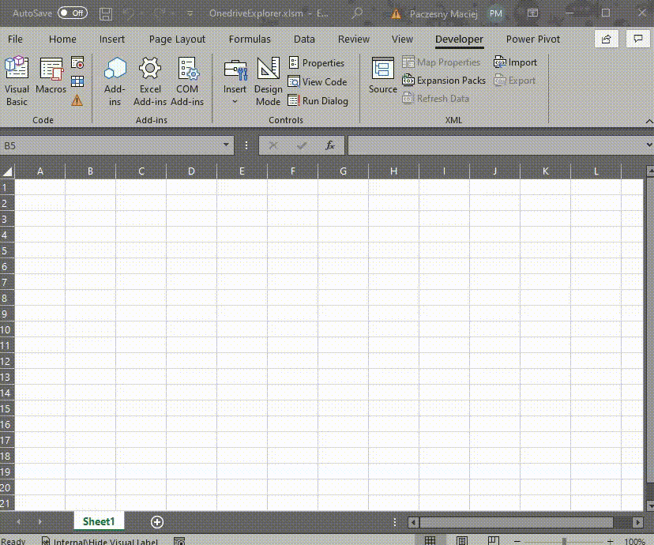

# VBA OneDrive explorer

A very simple VBA OneDrive explorer. It lets you navigate through files and folders in OneDrive. Uses Microsoft Graph api.



## Important

In order this to work you have to set Files.Read permissions for Microsoft Graph, please see [How to set Microsoft Graph permissions](#how-to-set-microsoft-graph-permissions).

## Installation

Import all files into macro enabled workbook. Add VBA references:

- Microsoft Scripting Runtime
- Microsoft VBScript Regular Expressions 5.5
- Microsoft WinHTTP Services, version 5.1
- Microsoft Internet Controls

It uses VBA-JSON library, you can download latest version from here [VBA-JSON](https://github.com/VBA-tools/VBA-JSON/releases).

## Usage

```vb
Public Sub ExampleOneDriveExplorer()

    ' Example how to use VBA OneDrive Explorer

    On Error GoTo ErrHandler
    
    Dim Token As String
    Token = "" ' paste your token here
    
    Dim entryPointPath As String
    entryPointPath = "https://graph.microsoft.com/v1.0/me/drive/root"

    Dim explorer As OneDriveFileExplorer
    Set explorer = New OneDriveFileExplorer
    explorer.Display entryPointPath:=entryPointPath, Token:=Token, userformTitle:="Select file", allowMultiselect:=True, selectMode:=ESelectModeAll

    If Not explorer.IsCancelled Then
        ' Printing selected items' id, path
        If Not explorer.SelectedItems Is Nothing Then
            Dim item As IDriveItem
            For Each item In explorer.SelectedItems
                Debug.Print item.Id, item.Path
            Next item
        End If
    End If

    Exit Sub
    
ErrHandler:
    MsgBox "Error!" & vbCrLf & vbCrLf & "Error description: " & err.Description & vbCrLf & "Error source: " & err.Source, vbExclamation, "Error!"

End Sub
```

OneDriveFileExplorer.Display arguments:

- entryPointPath - path to root OneDrive folder
- token - Microsoft Graph token (see [How to obtain Microsoft Graph token](#how-to-obtain-microsoft-graph-token))
- userformTitle - title with which the form will be displayed
- allowMultiselect - whether selecting multiple items is allowed or not
- selectMode - if ESelectModeAll then you can select files and folder, if ESelectModeFolder then only folders, if ESelectModeFile then only files

SelectedItems collection is collection of IDriveItem objects. From IDriveItem object you can obtain id and path of drive item (that is file or folder), eg.:

```vb
For Each item In explorer.SelectedItems
    Debug.Print item.Id, item.Path
Next item
```

See Examples module for more examples.

## How to set Microsoft Graph permissions

Register your application in Azure Portal [docs](https://docs.microsoft.com/en-us/graph/auth-register-app-v2) and set permissions (User.Read, Files.Read.All) for registered application.

If you do not want to get token via VBA go to [Graph Explorer](https://developer.microsoft.com/en-us/graph/graph-explorer) and log in. Click three dots menu button next to your account name and click Select permissions -> select Files and click Consent.

## How to obtain Microsoft Graph token

To obtain token via VBA register your application in Azure Portal [docs](https://docs.microsoft.com/en-us/graph/auth-register-app-v2). As a redirect uri use http://localhost (Web) and https://login.microsoftonline.com/common/oauth2/nativeclient (Mobile and desktop applications). Copy your client ID and client secret into VBA code:

```vb
Dim settings As RequestSettings
With New RequestSettings
    .ClientId = "client_id_from_microsoft_azure_portal"
    .ClientSecret = "client_secret_from_microsoft_azure_portal"
    .GrantType = "authorization_code"
    .RedirectUri = "http%3A%2F%2Flocalhost%2F"
    .ResponseMode = "query"
    .ResponseType = "code"
    .Scope = "offline_access%20user.read%20Files.ReadWrite.All"
    .State = "12345"
    .Tenant = "consumers" ' consumers/ organizations/ common
    Set settings = .Self
End With
```

Use IeTokenProvider with following arguments to get token:

```vb
Dim Token As String
Dim RefreshToken As String
With New IeTokenProvider
    .Init "https://login.microsoftonline.com/{tenant}/oauth2/v2.0/authorize?client_id={client_id}&response_type=code&redirect_uri={redirect_uri}&response_mode=query&scope={scope}&state={state}", _
            "https://login.microsoftonline.com/{tenant}/oauth2/v2.0/token", _
            "client_id={client_id}&client_secret={client_secret}&scope={scope}&code={code}&redirect_uri={redirect_uri}&grant_type={grant_type}", _
            LoginTimeout:=100, settings:=settings
    .GetToken
    Token = .Token
    RefreshToken = .RefreshToken
End With

Debug.Print "Token", Token
Debug.Print "RefreshToken", RefreshToken
```

See Examples module for more examples.

Alternativately go to [Graph Explorer](https://developer.microsoft.com/en-us/graph/graph-explorer) and log in. Click Access Token tab and copy token.

## Known issues

### Error: Unauthorized
Token is expired or invalid or user has insufficient permissions (see: [How to set Microsoft Graph permissions](#how-to-set-microsoft-graph-permissions)).